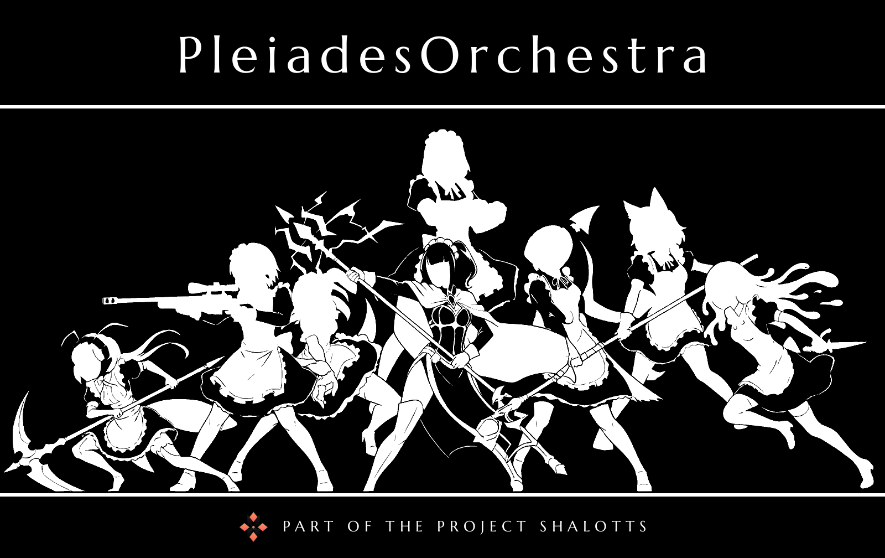

<div align="center">



**Open-source orchestrator with GOAP for tiny models. Provides website chatbot widget with 
custom providers. Main target its working with website or service mcp/webmcp for automatization 
from client side**

[](https://bun.com)
[](https://www.typescriptlang.org)
[](https://turborepo.com)
[](https://elysiajs.com)
[](https://svelte.dev)
[](https://www.sqlite.org)
[](https://docs.docker.com/compose/)
[](https://modelcontextprotocol.io)
[](https://biomejs.dev)

[](#quick-start)
[](#what-it-is)
[](docs/)

</div>

## What it is

- **MCP and web-MCP for websites** — simple sites and online shops now, CRM and BI later.
- **A chatbot for customers** that uses our own and third-party MCP/web-MCP to perform simple operations on a site: find a product, add it to the cart, remove it, compare.
- **Tiny/small models only** — built for small businesses without a GPU or budget for expensive models. The default is the self-hosted Pleiades provider; a paid cloud and third-party providers with small models are also supported.
- **GOAP planning**: the orchestrator builds a chain of actions towards a goal instead of running one big prompt.
- Agents work with facts and prepared answers; they don't promise professional consultation or the accuracy of large models.

## Quick start

```bash
bun install
cp .env.example .env            # and apps/*/.env.example → apps/*/.env
docker compose up --build       # the whole stack; one service: docker compose up -d --build <service>
```

```bash
bun run test                    # tests of every package via turbo
bun run lint                    # Biome
bun run check-types
```

The Telegram bot runs on a webhook — it needs a public tunnel to `localhost:3001` (`TELEGRAM_WEBHOOK_URL`).

## Minimal system requirements

The whole stack runs on one Linux x86-64 machine with Docker Compose. A GPU is optional.

| | Minimum | Recommended |
| --- | --- | --- |
| CPU | 4 cores | 6+ cores (Laya uses `LAYA_THREADS`, 6 by default) |
| RAM | 6 GB free (4 GB with a discrete GPU) | 8 GB free |
| Disk | 5 GB | 8 GB (images, models and logs grow) |
| GPU | not required | any Vulkan-capable GPU, an integrated one is enough |

The model in `beta-text` runs on the GPU through Vulkan when `/dev/dri` is passed through (`N_GPU_LAYERS=99`) and on the CPU otherwise (`N_GPU_LAYERS=0`). Measured on the reference machine (6 cores / 12 threads, 31 GB RAM, integrated Radeon), generation is ~44 tok/s on the GPU versus ~24 tok/s on 2 CPU threads.

Measured with `docker stats` on the idle stack (weights on the GPU):

| Service | RAM |
| --- | --- |
| `gamma-decision` (Laya, ONNX) | ~1.5 GiB |
| `admin-api` | ~90 MiB |
| `telegram-bot` | ~60 MiB |
| `alpha-orchestrator` | ~55 MiB |
| `beta-text` (`llama-server`) | ~165 MiB, plus the model in GPU-side memory (see below) |
| **Total** | **~2 GiB** |

Disk: images ~2.4 GB, models 2.4 GB (Laya 1.6 GB, GGUF 770 MB), SQLite databases a few MB.

The model file is 770 MB, but the running `llama-server` needs more than that: measured on the CPU (`-ngl 0`, `CTX_SIZE=2048`, after a real request) it holds **~1.5 GiB** (~0.85 GB of weights and libraries plus ~0.6 GB of KV cache and compute buffers). So the model alone takes ~1.5 GiB on the CPU. The whole stack (model ~1.5 GiB + Laya ~1.5 GiB + the small services ~0.25 GiB) needs ~3.5 GiB of RAM without a GPU; with a GPU the weights move out of the process, so `docker stats` shows only ~2 GiB for the stack. Where they end up depends on the GPU: a discrete card keeps them in its own VRAM, while an integrated one uses shared memory (GTT), which is ordinary system RAM that the container limit does not count — on the reference machine the GPU had 0.5 GiB of dedicated VRAM and 2.3 GiB of GTT in use. So with an integrated GPU plan for the same ~3.5 GiB of RAM. The GPU-side size of the model was not measured separately; ~1–1.5 GiB is an estimate from the CPU figure.

The minimums are derived from these numbers, not a tested floor, and the idle figures above do not include peaks under load. The CPU is what runs out first: lower `LAYA_THREADS` and `THREADS` on machines with fewer cores.

## Components

### The Pleiades

The agent services, each named after one of the Pleiades Six Stars

| Service | Role |
| --- | --- |
| [`alpha-orchestrator`](apps/alpha-orchestrator/README.md) | Orchestrator: GOAP planner, users, access, history, token usage (SQLite) |
| [`beta-text`](apps/beta-text/README.md) | Text model (`llama-server`, Vulkan) |
| [`gamma-decision`](apps/gamma-decision/README.md) | Fast typed decisions on Laya |

### Everything else

| Path | Role |
| --- | --- |
| `apps/telegram-bot`, `apps/cli` | Transports — thin clients of the orchestrator |
| `apps/admin-api`, `apps/admin` | Admin panel: API with accounts, and a static Svelte SPA |
| `apps/gemini-webapi-mcp` | Optional MCP server for Gemini (Python) |
| `packages/core`, `packages/elysia-kit` | GOAP core and shared Elysia setup |

## Documentation

All the main documentation lives in [`docs/`](docs/). Repository rules and lessons learned are in [`CLAUDE.md`](CLAUDE.md).

## References

- [goap-js](https://github.com/wmdmark/goap-js/tree/master) — a reference GOAP implementation
- [embabel](https://github.com/embabel/embabel-agent) - goap framework