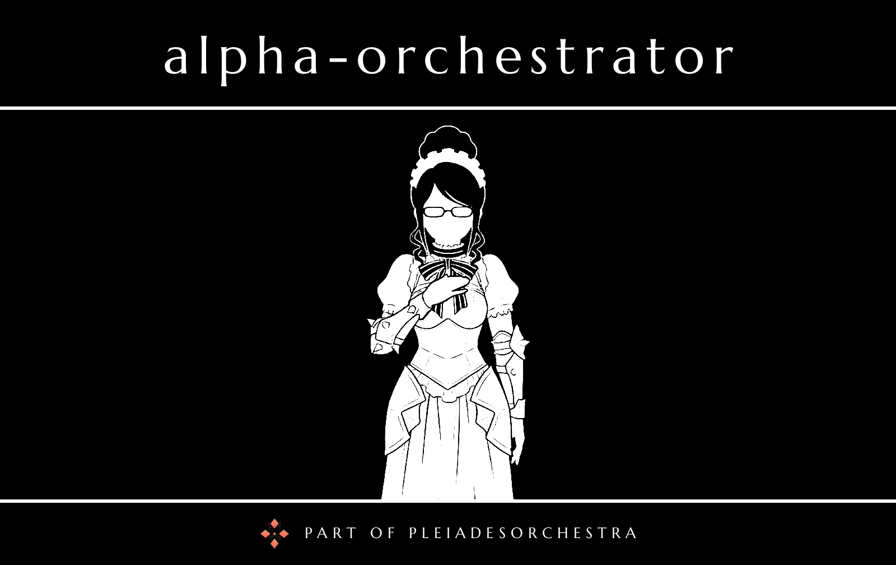

# Alpha Orchestrator

The orchestrator of [PleiadesOrchestra](../../README.md), named after Yuri Alpha.

It plans every reply as a chain of GOAP actions, calls [`beta-text`](../beta-text) for text and [`gamma-decision`](../gamma-decision) for typed decisions, and owns users, access rules, chat history, token usage and GOAP traces in SQLite. Transports (Telegram, CLI, site widget) and the admin panel talk to it over HTTP.
