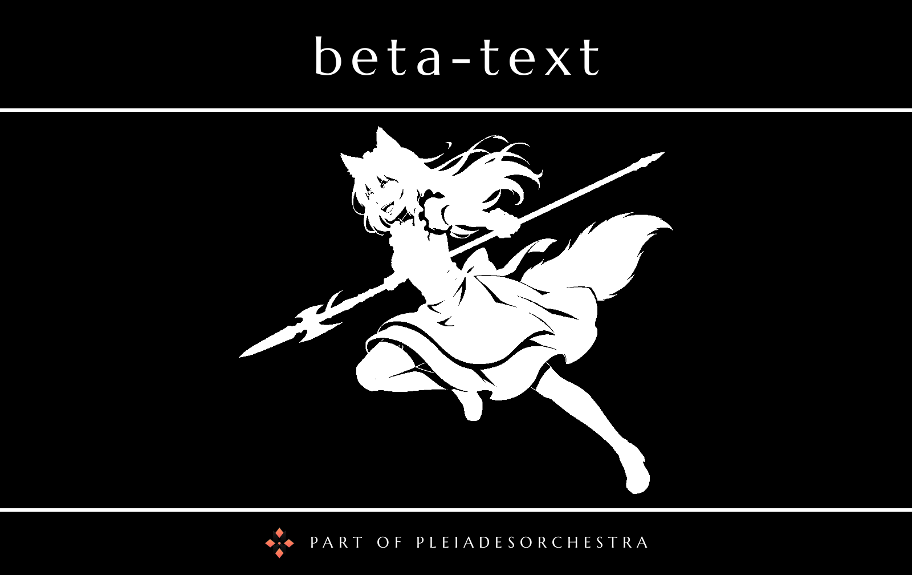

# Beta Text

The text model of [PleiadesOrchestra](../../README.md), named after Lupusregina Beta.

A `llama-server` (llama.cpp, Vulkan build) serving a small instruct model, Vikhr-Llama-3.2-1B (Q4_K_M), through an OpenAI-compatible API. It runs on the integrated GPU and downloads the model on first start.
