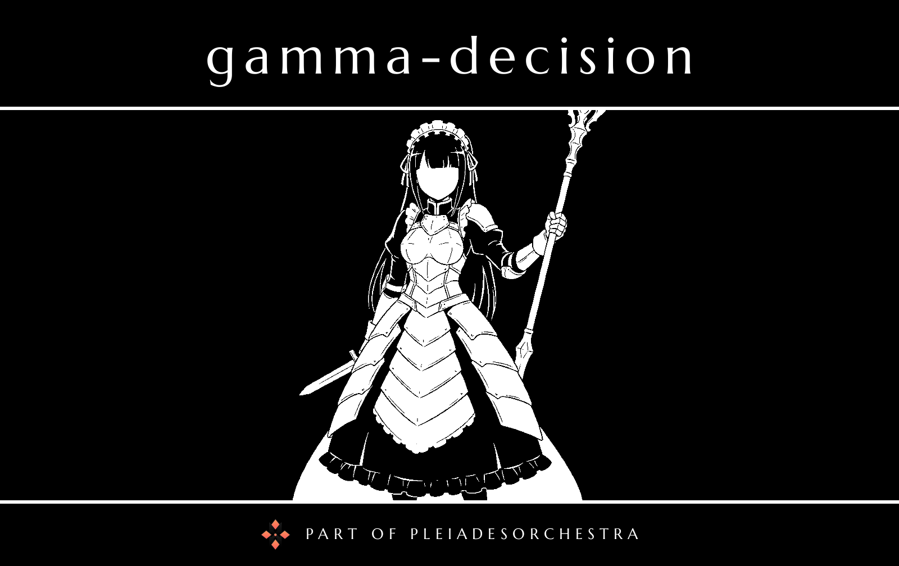

# Gamma Decision

The decision engine of [PleiadesOrchestra](../../README.md), named after Narberal Gamma.

A small HTTP service around [Laya](https://github.com/receptron/laya), a typed-decision model (ONNX Runtime): it answers choice and score questions about a state with calibrated probabilities and never generates text. Used by [`alpha-orchestrator`](../alpha-orchestrator) for fast, cheap decisions.
